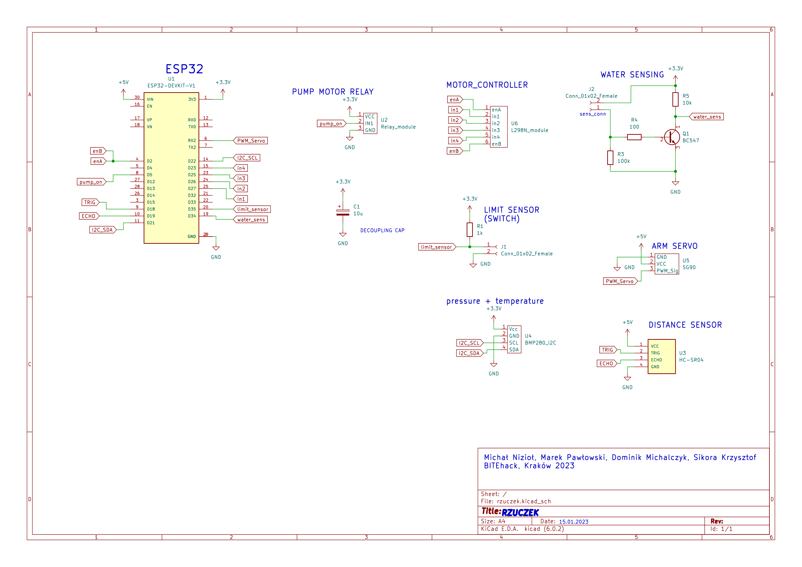
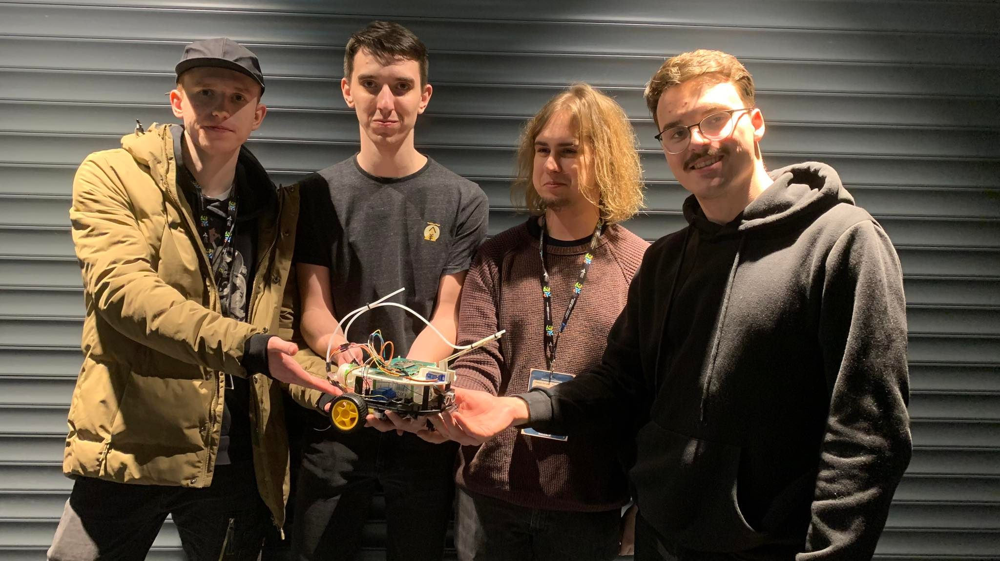

# Rzuczek - BITEhack 2023

**Robot built and programmed in 24 hours at Hackaton BITEhack 2023**

This repository contains:
* electronic schematics
* robot software
* rest-api
* 3D models

## Software development

Software for Rzucek was written in c++ in Visual Studio Code, compiled and uploaded to mircrocontroller via PlatformIO.

Project structure:
* include - contains headers
* src - .cpp files
* test
* lib

## Dependencies

## Electronics schematic

## Authors
Marek Pawłowski, Michał Nizioł, Dominik Michalczyk, Krzysztof Sikora
14-15.01.2023
